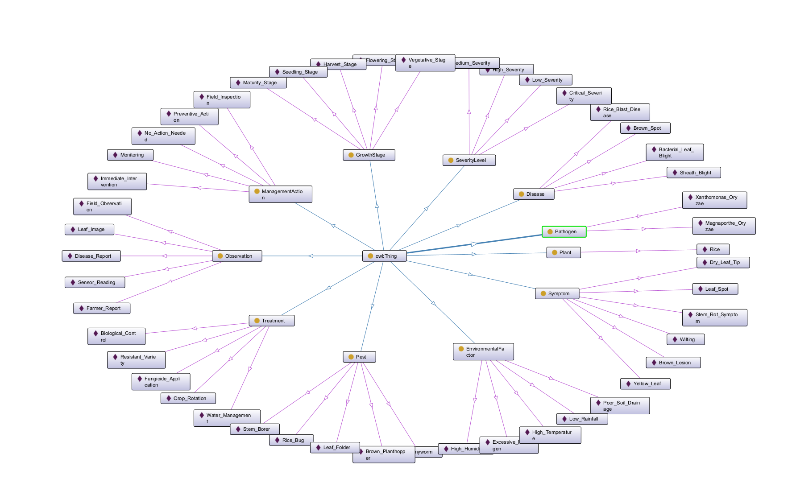

# Rice MMKG — Rice Multimodal Knowledge Graph

An OWL 2 ontology and multimodal knowledge graph modeling rice diseases, pests, pathogens, symptoms, environmental factors, growth stages, treatments, and management actions — populated from a large public image dataset, with sensor and text modalities designed in as declared extension points.



## Overview

Rice MMKG links agronomic, pathological, and entomological knowledge about rice cultivation into a single queryable graph, connecting what is *observed* (currently: 10,407 field images; sensor readings and field/text reports are declared extension points) to its *cause* (pathogens, pests, environmental stressors) and the *response* (treatments, management actions), contextualised by crop growth stage and severity level.

### Core Design Principles

- **Observation is kept separate from domain knowledge.** An `ImageObservation`'s raw dataset label (`annotatedAs`) is never conflated with curated symptom/cause/treatment relations (`captures`, `causes`, `indicatedBy`, ...) — what was recorded by computer vision is distinct from what is concluded by domain knowledge.
- **Every domain-level assertion is traceable.** All 265 populated domain triples (`causes`, `indicatedBy`, `occursIn`, `controlledBy`, `preventedBy`, `increaseRiskOf`, `vulnerableTo`, `recommends`, `requires`, `transmits`) are reified with `owl:Axiom` and carry `dcterms:source`, `dcterms:bibliographicCitation`, and `rice:evidenceType` — **100% provenance coverage**, verified against authoritative sources (IRRI, CABI, EPPO, BBPOPT).
- **Formal reasoning & falsifiable Competency Questions.** Evaluated under automated Description Logic (HermiT/Pellet) and rule-based (OWL RL) reasoning across 25 schema-level Competency Questions without permissive `OPTIONAL` clauses.

### Metadata Snapshot

- **Namespace:** `http://www.semanticweb.org/arifu/ontologies/2026/3/riceMMKG#` (permanent PURL `https://w3id.org/ricemmkg` in Phase 2)
- **Format:** OWL/XML (`.rdf`), fully compatible with [Protégé](https://protege.stanford.edu/)
- **Version:** `0.6` (live as of 2026-09-03) — actively progressing toward the **ESWC 2027 Resource Track** (see [`Ontology/riceMMKG_ESWC_plan.md`](Ontology/riceMMKG_ESWC_plan.md))
- **Triples:** **66,874** asserted triples / **161,568** materialised triples under OWL RL (+94,694 inferred triples)
- **Reasoner Consistency:** **100% Consistent** in HermiT & Pellet (0 unsatisfiable classes, 0 disjointness conflicts)

---

## Ontology Structure

### Classes (16)

| Class | Individuals | Description |
|---|---:|---|
| `ImageObservation` | 10,407 | Paddy Doctor field image instances |
| `SymptomaticObservation` | *(1,442 materialised)* | Defined class (`Observation that captures some Symptom`) — populated via OWL reasoning |
| `SensorObservation` | 0 | Declared scaffolding for microclimate & IoT sensor telemetry (Phase 3) |
| `Observation` | 0 | Abstract root observation superclass |
| `Dataset` (`dcat:Dataset`) | 1 | Metadata individual for the Paddy Doctor image collection |
| `Disease` | 9 | Diagnostic entities & damage conditions (including `Deadheart`, Bacterial Leaf Blight, Rice Blast, Tungro) |
| `Pest` | 7 | Insect pests and vectors (Stem Borer, Leaf Folder, Brown Planthopper, Armyworm, Rice Bug, Hispa, Green Leafhopper) |
| `Pathogen` | 8 | Microbial causal agents (Magnaporthe Oryzae, Xanthomonas pathovars, RTBV, RTSV) |
| `Plant` | 1 | The host crop (*Oryza sativa*) |
| `HealthStatus` | 1 | Non-disease reference baseline (`Normal_Health`) |
| `Symptom` | 27 | Visual symptoms (Leaf Rolling, Dead Tiller, White Ear, Brown Lesion, Wilting, etc.) |
| `GrowthStage` | 7 | Rice phenological stages (Seedling, Tillering, Vegetative, Reproductive, Flowering, Maturity, Harvest) |
| `EnvironmentalFactor` | 9 | Predisposing weather & field conditions (High Humidity, Waterlogged Soil, Dense Canopy, etc.) |
| `SeverityLevel` | 4 | Triage scales (Low, Medium, High, Critical) |
| `Treatment` | 12 | Practical interventions (Fungicide/Insecticide Application, Biological Control, Resistant Variety, Crop Rotation) |
| `ManagementAction` | 5 | Operational actions (Field Inspection, Monitoring, Immediate Intervention, Preventive Action, No Action Needed) |

### Object Properties (26)

Relations connect the domain entities with defined domains, ranges, and inverse pairs:
`causes`/`causedBy`, `transmits`/`transmittedBy`, `threatens`, `indicates`/`indicatedBy`, `controls`/`controlledBy`, `prevents`/`preventedBy`, `recommends`/`recommendedFor`, `requires`/`requiredFor`, `captures`/`capturedBy`, `detects`/`detectedBy`, `occursIn`, `hasOccurrenceOf`, `increaseRiskOf`/`riskIncreasedBy`, `vulnerableTo`, `annotatedAs`/`annotationOf`.

*Epidemiological distinction:* `causes` is strictly scoped to `Pathogen → Disease`, while insect vector transmission is modeled through `transmits`/`transmittedBy` (`Pest → Pathogen`), enabling explicit graph traversal from vector to pathogen to disease.

### Datatype Properties (5)

`confidenceScore`, `severityScore`, `interventionThreshold`, `observationDate`, `sourceDatasetLabel`

### Individuals & Provenance

- **10,498 named individuals**: 10,407 `ImageObservation` instances, 1 dataset metadata individual, plus 90 domain entities.
- **265 reified domain axioms**: 100% backed by `owl:Axiom` records with `dcterms:source`, `dcterms:bibliographicCitation`, and `rice:evidenceType`. Sources trace to CABI Crop Protection Compendium, IRRI Rice Knowledge Bank, EPPO Global Database, and BBPOPT Kementan RI.
- **External Alignment**: 33 `skos:exactMatch`, 17 `skos:closeMatch`, 1 `skos:broadMatch` to AGROVOC, NCBI Taxonomy, and EPPO identifiers, verified via live API checks.

### Paddy Doctor Dataset Alignment

The local Paddy Doctor image dataset is excluded from Git (`/Data/`). Folder labels are cleanly preserved via `sourceDatasetLabel`/`annotatedAs`.

| Paddy Doctor Label | Rice MMKG Entity | Semantic Type in v0.6 | Observed Symptom (`captures`) |
|---|---|---|---|
| `bacterial_leaf_blight` | `Bacterial_Leaf_Blight` | Disease | — (class-level annotation) |
| `bacterial_leaf_streak` | `Bacterial_Leaf_Streak` | Disease | — (class-level annotation) |
| `bacterial_panicle_blight` | `Bacterial_Panicle_Blight` | Disease | — (class-level annotation) |
| `blast` | `Rice_Blast_Disease` | Disease | — (class-level annotation) |
| `brown_spot` | `Brown_Spot` | Disease | — (class-level annotation) |
| `downy_mildew` | `Downy_Mildew` | Disease | — (class-level annotation) |
| `tungro` | `Rice_Tungro_Disease` | Disease | — (class-level annotation) |
| `hispa` | `Hispa` | Pest | — (class-level annotation) |
| `dead_heart` | `Deadheart` | Disease (Damage condition) | `Dead_Tiller` (Symptom, 1,442 images) |
| `normal` | `Normal_Health` | HealthStatus | — (reference baseline) |

---

## Competency Question (CQ) SPARQL Benchmark

Rice MMKG incorporates an automated verification harness (`cq_sparql_benchmark.py`) based on **25 Competency Questions** structured across:
- **Reasoning Depth (L1–L4):** L1 Factual (1-hop), L2 Contextual (multi-criteria joins), L3 Causal (multi-hop chains), L4 Inferential (OWL RL deduction).
- **Knowledge Dimensions (D1–D3):** D1 Agronomic/Symbolic, D2 Cross-modal Grounding, D3 Provenance & External Alignment.
- **Evaluation Modes:** `coverage` (≥ 50%), `negative` (0 violations), `entailment` (entailed > asserted), `documented` (declared extension point).

### Benchmark Summary (v0.6)

```
================================================================
  PASS      21 / 24  (87.5% Pass Rate)
  PARTIAL    1 / 24  (CQ-18 Symptom Visual Grounding: 4%)
  FAIL       2 / 24  (CQ-10 Vector Actionability, CQ-24 Literal Tag)
  DOC        1 / 25  (CQ-20 Sensor Observation Extension Point)
================================================================
```

- Complete documentation with exact SPARQL queries: [`Ontology/CQ SPARQL Benchmark/CQ_SPARQL_Documentation.md`](Ontology/CQ%20SPARQL%20Benchmark/CQ_SPARQL_Documentation.md)
- Automated execution report: [`Ontology/CQ SPARQL Benchmark/CQ_SPARQL_Benchmark_Report.md`](Ontology/CQ%20SPARQL%20Benchmark/CQ_SPARQL_Benchmark_Report.md)

---

## Roadmap Toward ESWC 2027

Our five-phase development roadmap toward the **ESWC 2027 Resource Track** is detailed in [`Ontology/riceMMKG_ESWC_plan.md`](Ontology/riceMMKG_ESWC_plan.md):

1. **Phase 1: Functional & Reasoning Evaluation (Weeks 1–2, Sept) — [90% Complete]**  
   25 CQs benchmark (87.5% pass rate), HermiT/Pellet 100% consistency, OWL RL materialisation (+94k triples).
2. **Phase 2: Availability, PURL & FAIR Polish (Weeks 3–4, Sept)**  
   Register permanent URI (`https://w3id.org/ricemmkg`), deploy pyLODE HTML documentation, deposit to Zenodo (DOI) & AgroPortal, achieve FOOPS! FAIR score > 0.85.
3. **Phase 3: Multimodal Experimentation (Weeks 5–8, Late Sept & Oct)**  
   Populate `SensorObservation` with microclimate telemetry, ingest field texts into `TextualObservation`, ground all 27 symptoms visually, and run tri-modal representation learning (IKRL).
4. **Phase 4: Domain Expert Validation (Weeks 9–10, Late Oct & Early Nov)**  
   Survey panel of plant pathologists and agronomists; compute Fleiss' Kappa ($\kappa$) inter-rater agreement.
5. **Phase 5: Resource Paper Drafting & Submission (Weeks 11–14, Nov – Early Dec)**  
   Author full LNCS manuscript, finalize reproducible GitHub release, and submit to ESWC 2027.

---

## Repository Contents

```
Ontology/
  Rice MMKG.rdf                  # Master ontology file (OWL/XML), v0.6
  Rice MMKG.properties           # Protégé project preferences
  Ontology_Overview.md           # Comprehensive structure, statistics, and full changelog
  riceMMKG_ESWC_plan.md          # 5-phase master roadmap toward ESWC 2027 submission
  Backup/                        # Preserved release backups (v0.2 through v0.5)
  CQ SPARQL Benchmark/
    cq_sparql_benchmark.py       # Automated Python/rdflib/owlrl benchmark runner
    cq_sparql_benchmark_results.json # Full machine-readable test results
    CQ_SPARQL_Benchmark_Report.md    # Formatted execution benchmark report
    CQ_SPARQL_Documentation.md      # Standalone CQ documentation with all 25 SPARQL queries
Analysis and Alignment/
    AGROVOC_alignment.md         # Vocabulary alignment to FAO AGROVOC
    NCBI_Taxonomy_alignment.md   # Organism-level alignment to NCBI Taxonomy
    Planteome_alignment.md       # Environmental factor alignment to Plant Ontologies
    PaddyDoctor_Dataset_Analysis.md # Dataset profile and ingestion strategy
Data/                            # Local image dataset (gitignored)
Worklog/                         # Internal cleanup and task logs (gitignored)
```

---

## Quick Start & Verification

### In Protégé
1. Open `Ontology/Rice MMKG.rdf` in Protégé 5.x.
2. Select **`Reasoner` → `HermiT`** (or `Pellet`).
3. Press **`Ctrl + R`** (`Start reasoner`). The reasoner will confirm global consistency (0 unsatisfiable classes) and classify 1,442 images under `SymptomaticObservation`.

### Programmatic SPARQL Benchmark via Python
Run the automated benchmark suite with OWL RL deductive closure:

```bash
python "Ontology/CQ SPARQL Benchmark/cq_sparql_benchmark.py"
```

```python
import rdflib

g = rdflib.Graph()
g.parse("Ontology/Rice MMKG.rdf", format="xml")
print(f"Asserted triples loaded: {len(g)}")
```

---

## Citation & License

- **License:** [Creative Commons Attribution 4.0 International (CC BY 4.0)](https://creativecommons.org/licenses/by/4.0/)
- **Author:** Muhammad Ariful Furqon (ORCID: [0000-0002-1031-3567](https://orcid.org/0000-0002-1031-3567)), Natthawut Kertkeidkachorn (ORCID: [0000-0003-4527-776X](https://orcid.org/0000-0003-4527-776X))
<!-- - **Cite as:**
  ```bibtex
  @misc{ricemmkg_2026,
    title  = {Rice MMKG: A Multimodal Knowledge Graph and Domain Ontology for Rice Disease and Pest Diagnosis},
    author = {Muhammad Ariful Furqon and Natthawut Kertkeidkachorn},
    year   = {2026},
    note   = {Version 0.6, evaluated with 25 Competency Questions and OWL RL reasoning}
  }
  ``` -->
